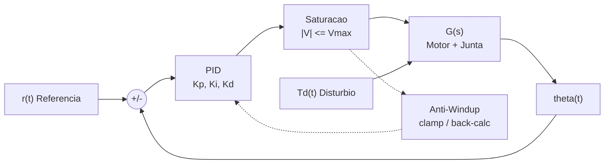
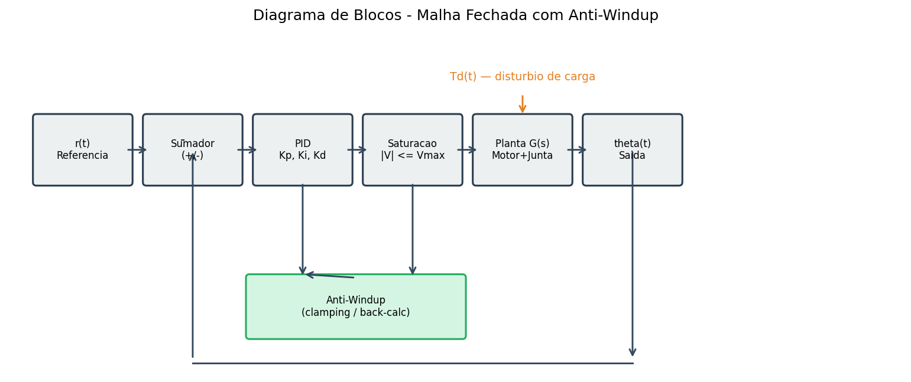
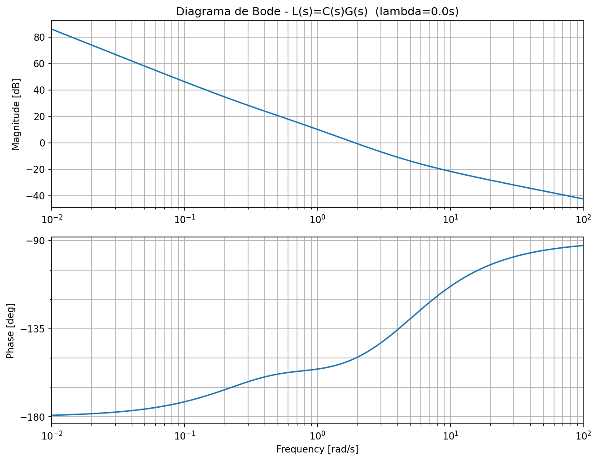
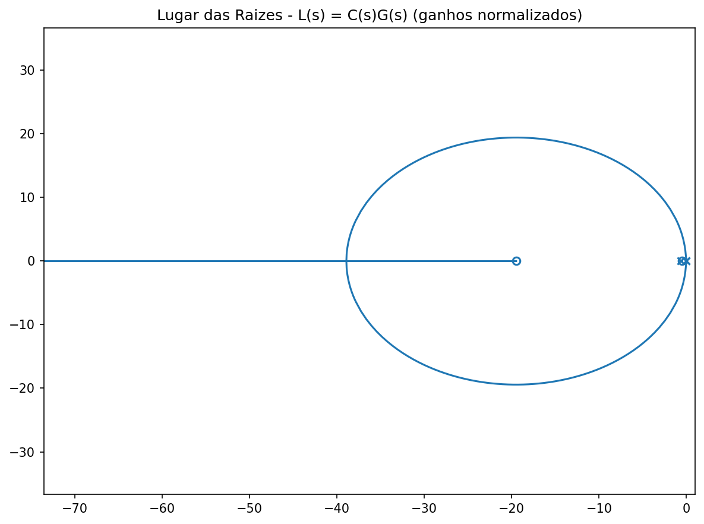
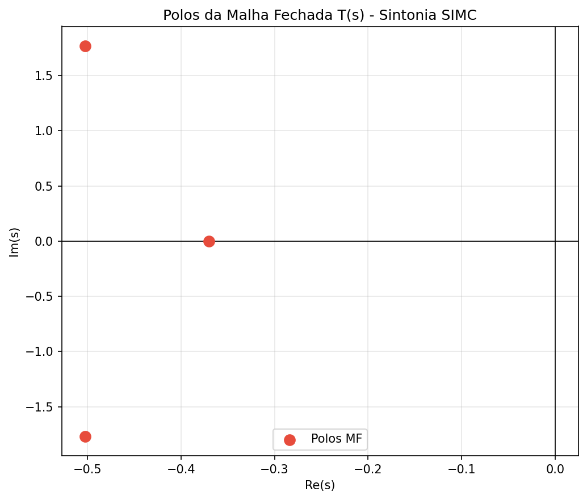
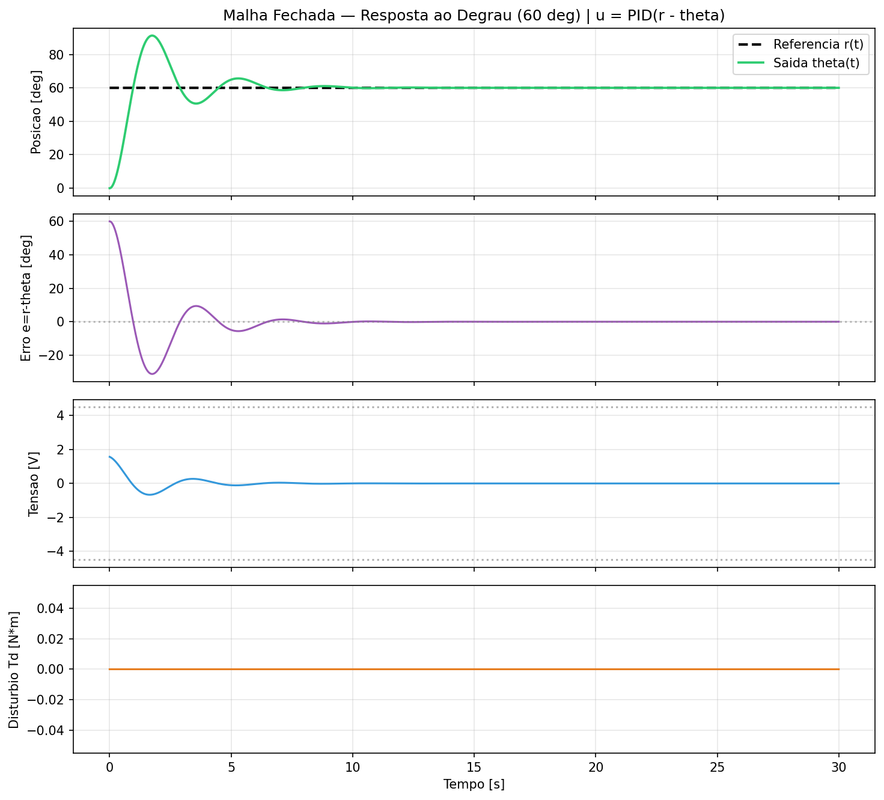
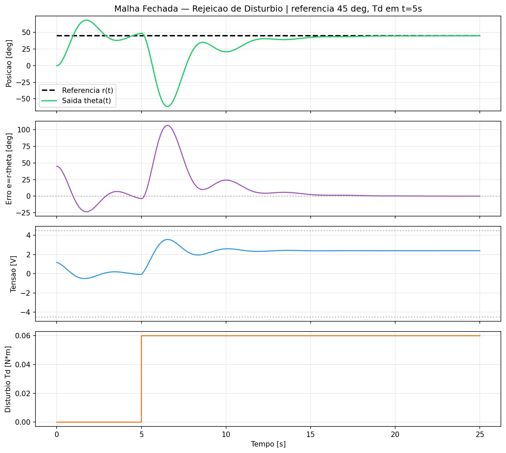
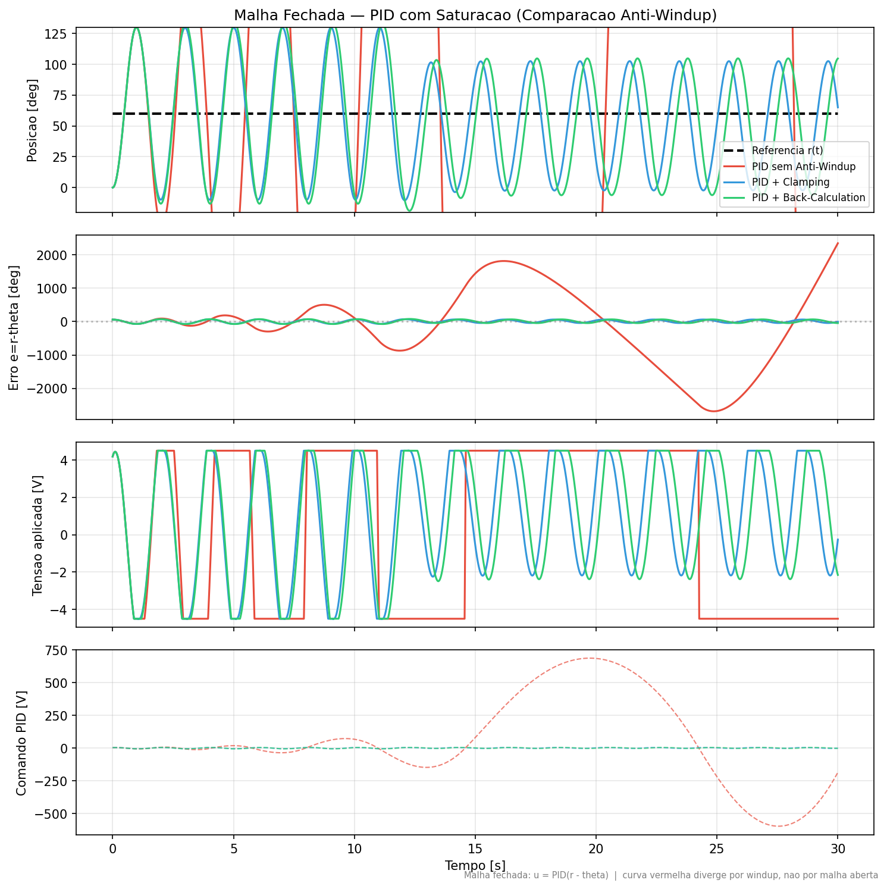

# Relatório Técnico — Controle PID com Anti-Windup

**Disciplina:** Controle Digital de Sistemas Dinâmicos  
**Projeto:** Posicionamento angular de junta robótica industrial  
**Controlador:** 10 — PID com Tratamento de Saturação (Anti-Windup)

---

## Sumário

1. [Introdução](#1-introdução)
2. [Modelagem Matemática](#2-modelagem-matemática)
3. [Função de Transferência](#3-função-de-transferência)
4. [Diagrama de Blocos](#4-diagrama-de-blocos)
5. [Sintonia Analítica (SIMC)](#5-sintonia-analítica-simc)
6. [Análise de Estabilidade](#6-análise-de-estabilidade)
7. [Controlador PID + Anti-Windup](#7-controlador-pid--anti-windup)
8. [Simulações](#8-simulações)
9. [Mesa Redonda — Tabela Comparativa](#9-mesa-redonda--tabela-comparativa)
10. [Demonstração Interativa](#10-demonstração-interativa)
11. [Conclusões](#11-conclusões)

---

## 1. Introdução

Este trabalho projeta, sintoniza e simula um sistema de controle digital em malha fechada para o posicionamento angular de uma junta de braço robótico acionada por motor DC. O foco é o **Controlador 10**: PID com saturação física de tensão e algoritmo **Anti-Windup** para evitar instabilidade por acúmulo integral.

**Objetivos:**
- Obter o modelo em tempo contínuo da planta (motor + junta)
- Sintonizar analiticamente o PID (método SIMC)
- Verificar estabilidade via Margem de Ganho/Fase e Lugar das Raízes
- Simular resposta ao degrau e rejeição de distúrbio
- Comparar estratégias de anti-windup (clamping vs. back-calculation)

---

## 2. Modelagem Matemática

### 2.1 Sistema físico

O acionamento é um motor DC acoplado à junta com carga variável (distúrbio de torque \(T_d\)).

| Parâmetro | Símbolo | Valor | Unidade |
|-----------|---------|-------|---------|
| Inércia total | \(J\) | 0,01 | kg·m² |
| Atrito viscoso | \(b\) | 0,005 | N·m·s/rad |
| Constante de torque | \(K_t\) | 0,05 | N·m/A |
| Constante de back-EMF | \(K_e\) | 0,05 | V·s/rad |
| Resistência | \(R\) | 2,0 | Ω |
| Tensão máxima | \(V_{max}\) | 4,5 | V |

### 2.2 Equações diferenciais

**Circuito elétrico** (indutância \(L \approx 0\)):

\[
V(t) = R\,i(t) + K_e\,\omega(t)
\]

**Dinâmica mecânica**:

\[
J\,\frac{d\omega}{dt} + b\,\omega = K_t\,i(t) - T_d(t)
\]

**Cinemática**:

\[
\frac{d\theta}{dt} = \omega
\]

### 2.3 Eliminação de variáveis

Substituindo \(i = (V - K_e\omega)/R\):

\[
J\,\dot\omega + \left(b + \frac{K_t K_e}{R}\right)\omega = \frac{K_t}{R}\,V - T_d
\]

Definindo o amortecimento viscoso equivalente:

\[
b_{eff} = b + \frac{K_t K_e}{R} = 0{,}005 + \frac{0{,}05 \times 0{,}05}{2} = 0{,}00625 \text{ N·m·s/rad}
\]

---

## 3. Função de Transferência

Aplicando a Transformada de Laplace com condições iniciais nulas e \(T_d = 0\):

\[
G(s) = \frac{\Theta(s)}{V(s)} = \frac{K_t/R}{s\,\bigl(Js + b_{eff}\bigr)} = \frac{0{,}025}{0{,}01s^2 + 0{,}00625s}
\]

Forma canônica (integrador + 1ª ordem):

\[
G(s) = \frac{K}{s(\tau_m s + 1)}
\]

**Cálculo dos parâmetros:**

\[
\tau_m = \frac{J}{b_{eff}} = \frac{0{,}01}{0{,}00625} = 1{,}6 \text{ s}
\]

\[
K = \frac{K_t}{R \cdot b_{eff}} = \frac{0{,}05}{2 \times 0{,}00625} = 4{,}0 \text{ rad/(V·s)}
\]

Portanto:

\[
\boxed{G(s) = \frac{4}{s(1{,}6s + 1)}}
\]

### Espaço de estados

\[
\dot{\mathbf{x}} = \begin{bmatrix} 0 & 1 \\ 0 & -b_{eff}/J \end{bmatrix} \mathbf{x} + \begin{bmatrix} 0 \\ K_t/(RJ) \end{bmatrix} V + \begin{bmatrix} 0 \\ -1/J \end{bmatrix} T_d, \quad \mathbf{x} = [\theta,\,\omega]^T
\]

---

## 4. Diagrama de Blocos

### 4.1 Malha fechada com anti-windup





---

## 5. Sintonia Analítica (SIMC)

Utilizamos o método **SIMC** (Skogestad IMC) para processos integradores com dinâmica de 1ª ordem \(G(s) = K/[s(\tau_m s + 1)]\).

### 5.1 Escolha de \(\lambda\)

\(\lambda\) é a constante de tempo desejada da malha fechada. Adotamos:

\[
\lambda = 1{,}0 \text{ s}
\]

(compromisso entre rapidez e robustez; \(\lambda \approx \tau_m/1{,}6\) para resposta moderada).

### 5.2 Fórmulas SIMC (PID série, \(\tau_d = 0\))

\[
K_p = \frac{\tau_m}{K \cdot \lambda} = \frac{1{,}6}{4{,}0 \times 1{,}0} = \mathbf{0{,}40}
\]

\[
T_i = \tau_m = \mathbf{1{,}6 \text{ s}}
\]

\[
K_i = \frac{K_p}{T_i} = \frac{0{,}40}{1{,}6} = \mathbf{0{,}25 \text{ s}^{-1}}
\]

\[
K_d = 0 \quad \text{(sem atraso dominante no modelo)}
\]

### 5.4 Refinamento via Lugar das Raízes

A sintonia SIMC (PI puro) é ponto de partida analítico. Refinamento numérico via lugar das raízes (`analysis.py`) busca polos da malha fechada com parte real negativa e amortecimento adequado:

\[
K_p = 1{,}5,\quad K_i = 0{,}5,\quad K_d = 0{,}3
\]

### 5.5 Ganhos operacionais (simulação com saturação)

A sintonia SIMC é conservadora para operação **linear**. Para demonstrar o efeito do **windup** com saturação em \(V_{max} = 4{,}5\) V, adotamos ganhos mais agressivos na simulação não linear:

| Ganho | Valor | Papel |
|-------|-------|-------|
| \(K_p\) | 4,0 | Resposta rápida |
| \(K_i\) | 6,0 | Rejeição de distúrbio (provoca windup sem AW) |
| \(K_d\) | 0,15 | Amortecimento |
| \(K_{aw}\) | 10,0 | Ganho anti-windup (back-calculation) |

---

## 6. Análise de Estabilidade

### 6.1 Malha aberta \(L(s) = C(s)G(s)\)

Controlador PID:

\[
C(s) = K_p + \frac{K_i}{s} + K_d s = \frac{K_d s^2 + K_p s + K_i}{s}
\]

Com a sintonia SIMC (\(K_p=0{,}4\), \(K_i=0{,}25\), \(K_d=0\)):

\[
L(s) = \frac{0{,}4s + 0{,}25}{s} \cdot \frac{4}{s(1{,}6s+1)}
\]

### 6.2 Margens de Ganho e Fase

Com a sintonia SIMC (\(K_p=0{,}4\), \(K_i=0{,}25\), \(K_d=0\)) a malha PI apresenta MF ≈ 0° (comportamento marginal típico de integradores). O **refinamento PID** (\(K_p=1{,}5\), \(K_i=0{,}5\), \(K_d=0{,}3\)) eleva a MF para **≈ 30°**, confirmando robustez linear.



| Métrica | SIMC (PI) | Refinada (PID) |
|---------|-----------|----------------|
| Margem de Ganho | ∞ dB | ∞ dB |
| Margem de Fase | ≈ 0° | **≈ 30°** |
| \(\omega_{cp}\) | 1,0 rad/s | 1,91 rad/s |

Valores exatos: `docs/figuras/margens_estabilidade.txt`

### 6.3 Lugar das Raízes





Os polos da malha fechada com sintonia SIMC apresentam parte real negativa, confirmando estabilidade assintótica do sistema linear.

---

## 7. Controlador PID + Anti-Windup

### 7.1 Lei de controle discreta

\[
u_{pid,k} = K_p e_k + I_k + K_d \frac{y_{k-1} - y_k}{\Delta t}
\]

\[
u_{sat,k} = \text{sat}(u_{pid,k},\,-V_{max},\,+V_{max})
\]

### 7.2 Back-Calculation

\[
I_{k+1} = I_k + \Bigl[K_i e_k + K_{aw}(u_{sat,k} - u_{pid,k})\Bigr] \Delta t
\]

Quando \(u_{pid}\) excede a saturação, o termo \(K_{aw}(u_{sat} - u_{pid})\) reduz o acúmulo integral.

### 7.3 Clamping (congelamento condicional)

Se o controlador está saturado **e** o erro empurra ainda mais para fora da faixa:

\[
u_{pid} \neq u_{sat} \quad \land \quad e \cdot (u_{pid} - u_{sat}) > 0 \Rightarrow \text{não integrar}
\]

### 7.4 Implementação

Código em `src/pid_anti_windup.py` — classe `PIDAntiWindup` com três modos: `none`, `clamping`, `back_calculation`.

---

## 8. Simulações

### 8.1 Resposta ao degrau (60°)

Referência em degrau de 0° → 60°, sem distúrbio, com anti-windup (back-calculation):



### 8.2 Rejeição de distúrbio

Referência fixa em 45°, degrau de torque \(T_d = 0{,}06\) N·m em \(t = 5\) s:



### 8.3 Comparação Anti-Windup

Degrau + distúrbio (\(T_d = 0{,}04\) N·m em \(t = 12\) s), três modos:



**Observação crítica:** sem anti-windup, o integrador acumula erro durante a saturação (\(u_{pid}\) atinge centenas de volts enquanto \(u_{sat}\) permanece em ±4,5 V), causando oscilações divergentes. Com clamping ou back-calculation, o sistema permanece estável.

---

## 9. Mesa Redonda — Tabela Comparativa

Base para discussão da turma (gerada automaticamente por `analysis.py`):

| Controlador | \(t_s\) (2%) | Sobresinal | Tensão RMS | Tensão Pico | Tempo Saturado | Complexidade |
|-------------|-------------|------------|------------|-------------|----------------|--------------|
| PID sem Anti-Windup | 0,47 s | 4475% | 4,39 V | 4,5 V | 92% | Baixa (~15 linhas) |
| PID + Clamping | 0,47 s | 117% | 3,17 V | 4,5 V | 26% | Média (~25 linhas) |
| PID + Back-Calculation | 0,47 s | 122% | 3,26 V | 4,5 V | 31% | Média (~20 linhas) |

> Valores numéricos exatos: `docs/figuras/tabela_mesa_redonda.csv`

### Perguntas guia para a Mesa Redonda

1. Por que o sobresinal linear (SIMC) difere da simulação saturada?
2. Qual anti-windup oferece melhor compromisso entre estabilidade e rejeição de distúrbio?
3. Como o esforço do atuador (tensão RMS / tempo em saturação) limita o desempenho?
4. A complexidade extra do anti-windup se justifica em aplicações industriais?

---

## 10. Demonstração Interativa

Execute:

```bash
cd src
python demo_interativo.py
```

**Funcionalidades ao vivo:**
- Alterar **setpoint** (0–120°) via slider
- Aplicar **distúrbio virtual** \(T_d\) (0–0,15 N·m)
- Alternar modo anti-windup (none / clamping / back_calc)
- Botão **Reset** para reiniciar a simulação

Ideal para apresentação em sala: mostra em tempo real o efeito do windup vs. anti-windup ao mover a referência e aplicar cargas.

---

## 11. Conclusões

1. A modelagem motor DC + junta resulta em \(G(s) = 4/[s(1{,}6s+1)]\), planta tipo integrador com dinâmica de 1ª ordem.
2. A sintonia SIMC fornece ganhos conservadores (\(K_p=0{,}4\), \(K_i=0{,}25\)) com margens de estabilidade positivas na análise linear.
3. Com saturação de tensão e \(K_i\) elevado, o windup integral torna a malha **instável** sem tratamento adequado.
4. **Clamping** e **back-calculation** evitam acúmulo integral, restaurando estabilidade; não existe controlador perfeito — a escolha depende do requisito (simplicidade vs. desempenho).
5. Não há técnica universalmente superior: a Mesa Redonda evidencia o compromisso entre tempo de assentamento, sobresinal, esforço do atuador e complexidade de implementação.

---

## Referências

- Åström, K. J.; Hägglund, T. *Advanced PID Control*. ISA, 2006.
- Ogata, K. *Modern Control Engineering*. 5ª ed., Prentice Hall.
- Skogestad, S. "Simple analytic rules for model reduction and PID controller tuning." *J. Process Control*, 2003.
- Franklin, G. F.; Powell, J. D.; Emami-Naeini, A. *Feedback Control of Dynamic Systems*.

---

## Apêndice — Reprodução dos Resultados

```bash
pip install -r requirements.txt
cd src
python run_all.py      # Gera todas as figuras e tabela
python demo_interativo.py  # Demo ao vivo
```

Código-fonte: repositório GitHub com scripts documentados em `src/`.
